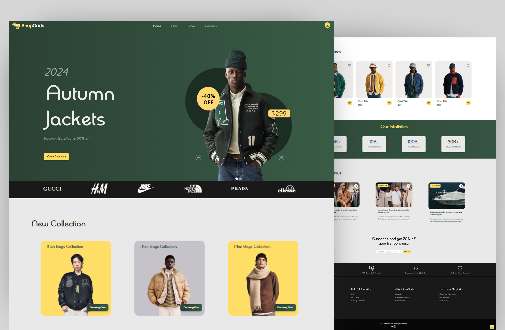

<div align="center">
<h1 align="center">🛒 ShopGrids – Responsive eCommerce Website Template</h1>
ShopGrids is a fully responsive eCommerce website template designed for modern online stores. Built with HTML, CSS, JavaScript, and Bootstrap 5, this template ensures a seamless shopping experience on all devices.
<br />
<br />
<a href="https://ahmed-abd-alalim.github.io/ShopGrids/"><strong>➥ Live Demo</strong></a>
<br />
<br />
</div>

## Demo




## programming language and tools

<p>
   <a href="#">
    
   </a>
</p>


##  Features

<p>✅ Fully Responsive – Adapts to all screen sizes</p>
<p>✅ Bootstrap 5 – Modern and flexible UI components</p>
<p>✅ Clean & Modern Design – Professional eCommerce layout</p>
<p>✅ Product Listings & Filters – Showcase and sort products easily</p>
<p>✅ Shopping Cart & Checkout – Smooth purchase experience</p>
<p>✅ Optimized Performance – Fast loading and SEO-friendly</p>

## Prerequisites

Before you begin, ensure you have met the following requirements:

* [Git](https://git-scm.com/downloads "Download Git") must be installed on your operating system.


## Installing ShopGrids

To install **ShopGrids**, follow these steps:

Linux and macOS:

```bash
sudo git clone https://github.com/ahmed-abd-alalim/ShopGrids.git
```

Windows:

```bash
git clone https://github.com/ahmed-abd-alalim/ShopGrids.git
```


## Contact

<p align="left">
  <a href="https://www.linkedin.com/in/ahmed-abd-alalim-286768299/" target="_blank"></a>
</p>


## License

This program has been licensed under the MIT License. If you are a true FOSS (Free And Open Source Software) Lover, you wont customize this and redistribute this under your name

This project is an e-commerce platform named MarketPeak. It was developed, version-controlled using Git, deployed to an AWS EC2 instance, and served via Apache.

# Deployment step

## step1: lounch EC2 Instance
- Launch a new ec2 ubuntu instance on AWS.
- Salected latest ubuntu AMI (24.04 "Noble")
- opened port 80 (HTTP) and port 22(SSH) in the EC2 security group.

## Configure the server:
- sudo apt update 
- sudo apt install apache2 -y

. Enable apache to start on boot
-sudo systemctl enable apache2
-sudo systemctl start apache2

. verify apache was running
- sudo systemctl status apache2

## step 3. set up Git and Clone reository;
- sudo apt install -y
- git clone https://github.com/abdul304m/MarketPeak_Ecommerce.git
- cd MarketPeak_Ecommerce

. Created New branch
- git checkout -b development

## Modify Website.
. edited index.html
<h1 style="font-size: 3rem; color: #333; ">Welcome to MarketPeak</h1>
<p style="font-size: 1.2rem; color: #555; ">your one-stop shop for the best online deals</p>
</section>
<h2 style="font-size : 2rem; color: #222;">Welcome To MarketPeak!</h2>
<p style="font-size: 1.1rem; color: #444;">Discover top deals on tech gadgets, fashion, and more.</p>
</section>

. committed and push changes:
git add .
git commit -m "updating Homepage banner"
git push origin development

## step 4. pull request & merge:
- created pull request from development to main on Github

- merge after review

## step 6. Deploy to apache (EC2)
- Copied updated file to apache's root
sudo cp ~/MarketPeak_Ecommerce/index.html /var/www/html/index.html

- veified apache is serving it
curl http://localhost

## step 7. Test website
- visited http://54.226.40.3/

## TROUBLESHOOTING AND CHALLENGES
1. Index.html update not appearing
solution: we used "curl http://localhost" to verify server content. cleared cache browser.

2. Github SSH clone failed .
solution: switched to https cloning to avoid SSH key issue. 